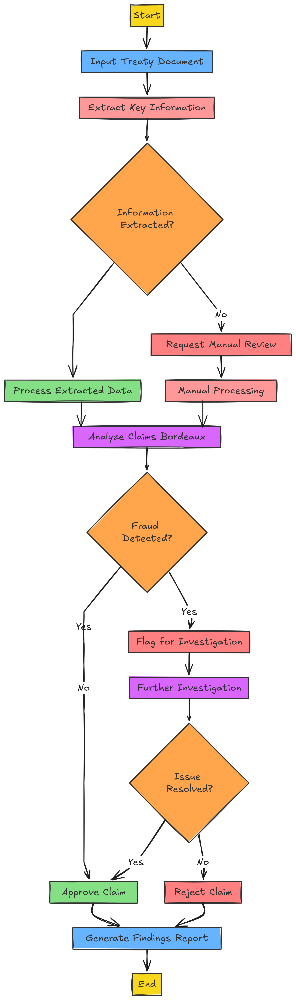

# Claims Processing Application

# A. Problem Description
The claims processing workflow in reinsurance is highly manual and time-consuming, involving various documents such as the Claims Bordereaux, Treaty Slip, and Treaty Statement. Each document contains critical financial data that must be validated and reconciled to ensure accuracy. The manual process is prone to errors, especially when calculating the reinsurance company’s participation share in claims payments. This inefficiency can lead to discrepancies, delays, and a lack of real-time reporting, creating challenges for companies that need to process claims efficiently and accurately.

# B. Proposed Solution Description
This automated claims processing system is built using **Python**, leveraging data processing libraries such as **Unstructured** for efficient data handling, **Google Gemini Large Language Model** for fraud detection. The system takes a **treaty document**, **borderaux**, and **claims document** as input and processes the claims to determine whether they are fraudulent or legitimate, ultimately accepting or rejecting the claims based on the results.

## Technologies Used
- **Languages**: Python
- **Libraries**: Unstructured.io, Langchain, Google Gemini
- **Frameworks**: Streamlit

## How the System Works

## Features
- **Automated Claims Processing**: Automatically processes claims based on the provided treaty and borderaux documents, minimizing manual intervention.
- **Fraud Detection**: Uses machine learning models to identify potential fraudulent claims by analyzing patterns and inconsistencies in the claims data.
- **Claims Validation**: Accepts or rejects claims by comparing claim details with predefined rules, such as treaty limits, policy conditions, and maximum cession amounts.

## Input Documents
1. **Treaty Document**: Contains key treaty details such as total premium, retention percentage, maximum cession, and terms of agreement.
2. **Borderaux Document**: Provides a list of claims with details like policyholder information, claim amounts, and treatment dates.
3. **Claims Document**: Contains individual claims, including information such as claim amount, treatment date, and approval status.

## Output
- **Claims Report**: A detailed, machine-generated report that specifies the status of each claim (accepted or rejected) and flags any claims identified as fraudulent.
- **Summary**: A high-level summary of the total number of claims processed, total amounts paid, and any claims exceeding the claim limit or deemed fraudulent.

## Usage
1. **Prepare Input Documents**: Ensure that the treaty, borderaux, and claims documents are formatted correctly (PDF/CSV/Excel).
2. **Run the Application**: Execute the claims processing application, which reads the input documents, performs analysis, and generates the report.
3. **Review Results**: Review the claims report and summary to verify the status of claims and analyze any detected fraud or exceptions.
